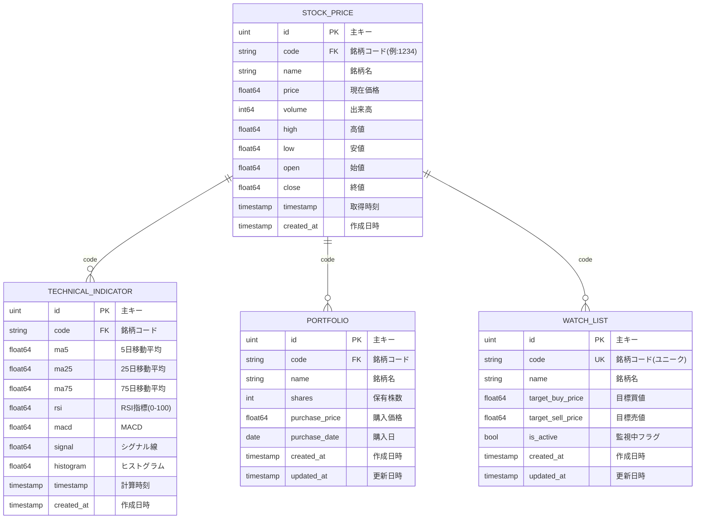

# データベース設計 - ER図

## 概要

株式自動化システムのデータベース設計を可視化し、各エンティティの関係性と目的を明確化します。

## 📊 ER図



## 🎯 各テーブルの目的と使用用途

### 📈 STOCK_PRICE（株価データ）
**目的**: Yahoo Finance APIから取得した株価データの保存

**主な用途**:
- リアルタイム株価監視
- 履歴データ分析
- テクニカル指標の計算元データ
- ポートフォリオ評価の基準価格

**重要な関数**:
```go
// 損益計算
func (s *StockPrice) CalculateGainLoss(portfolio Portfolio) float64

// 利回り計算  
func (s *StockPrice) CalculateReturnRate(portfolio Portfolio) float64
```

### 📊 TECHNICAL_INDICATOR（テクニカル指標）
**目的**: 株価データから計算されたテクニカル分析指標の保存

**主な用途**:
- 移動平均線による トレンド分析
- RSI による買われすぎ・売られすぎ判定
- MACD による売買タイミング判定
- 投資判断アルゴリズムの入力データ

**重要な関数**:
```go
// 投資シグナル判定
func (t *TechnicalIndicator) GetSignalStrength() string
// "Strong Buy" / "Strong Sell" / "Neutral"
```

### 💼 PORTFOLIO（ポートフォリオ）
**目的**: 実際に保有している銘柄と投資実績の管理

**主な用途**:
- 保有銘柄の損益計算
- ポートフォリオ全体の評価額計算
- 投資パフォーマンス分析
- 日次レポート生成

**重要な関数**:
```go
// 現在の評価額計算
func (p *Portfolio) CalculateTotalValue(currentPrice float64) float64

// 投資元本計算
func (p *Portfolio) GetPurchaseValue() float64
```

### 👀 WATCH_LIST（監視銘柄）
**目的**: 投資候補銘柄の監視と売買タイミングの管理

**主な用途**:
- 投資候補銘柄の価格監視
- 指値注文のような自動売買判定
- 買い時・売り時のアラート生成
- 投資機会の自動検出

## 🔄 データフロー

### 1. データ収集フロー
```
Yahoo Finance API → STOCK_PRICE → TECHNICAL_INDICATOR
```

### 2. 投資判断フロー  
```
TECHNICAL_INDICATOR → 投資シグナル計算 → WATCH_LIST更新
```

### 3. レポート生成フロー
```
PORTFOLIO + STOCK_PRICE → 損益計算 → 日次レポート → Slack通知
```

### 4. 監視・アラートフロー
```
WATCH_LIST + STOCK_PRICE → 価格監視 → 条件判定 → Slack通知
```

## 📋 インデックス設計

### 性能最適化のためのインデックス

```sql
-- 銘柄コードでの高速検索
CREATE INDEX idx_stock_price_code ON stock_price(code);
CREATE INDEX idx_technical_indicator_code ON technical_indicator(code);
CREATE INDEX idx_portfolio_code ON portfolio(code);

-- 時系列データの高速取得
CREATE INDEX idx_stock_price_timestamp ON stock_price(timestamp);
CREATE INDEX idx_technical_indicator_timestamp ON technical_indicator(timestamp);

-- 複合インデックス（銘柄×時間での検索最適化）
CREATE INDEX idx_stock_price_code_timestamp ON stock_price(code, timestamp);
CREATE INDEX idx_technical_indicator_code_timestamp ON technical_indicator(code, timestamp);

-- ユニーク制約
CREATE UNIQUE INDEX idx_watch_list_code ON watch_list(code);
```

## 🎯 システムの動作理解

このER図により、以下のシステム動作が理解できます：

1. **株価データ収集**: Yahoo Finance → STOCK_PRICE
2. **技術分析**: STOCK_PRICE → TECHNICAL_INDICATOR  
3. **投資判断**: TECHNICAL_INDICATOR → 買い/売りシグナル
4. **ポートフォリオ管理**: PORTFOLIO × STOCK_PRICE → 損益計算
5. **監視・アラート**: WATCH_LIST × STOCK_PRICE → 通知判定

**次に実装するsprintf関数の目的**: 
ポートフォリオ分析結果を読みやすい日本語レポートに整形し、Slack通知で投資状況を把握するため。