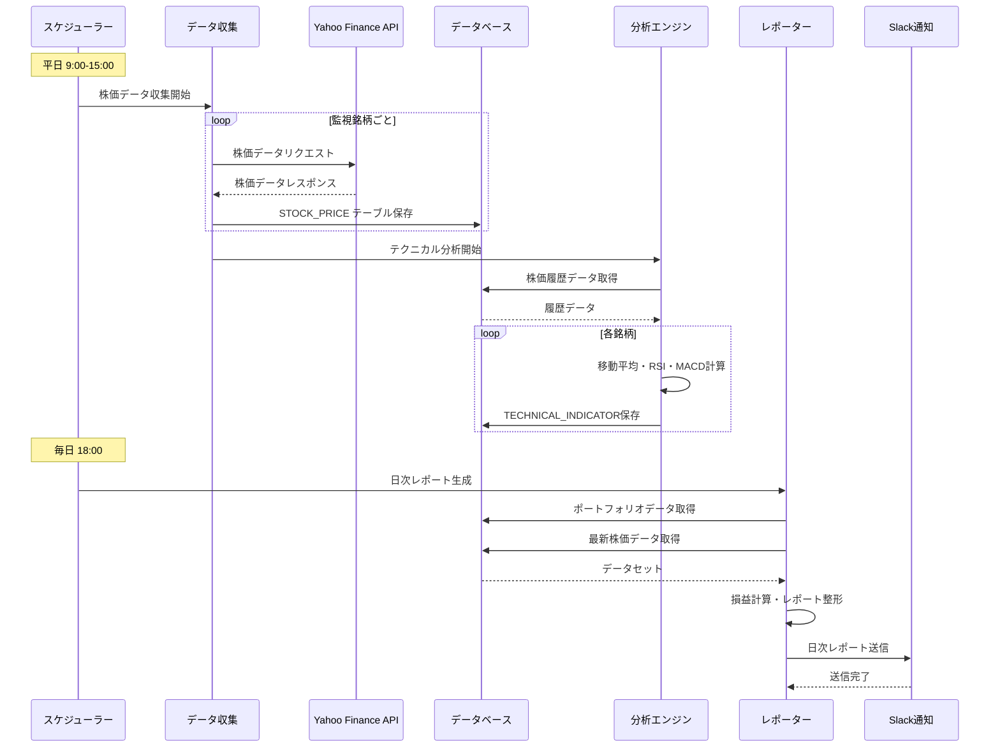
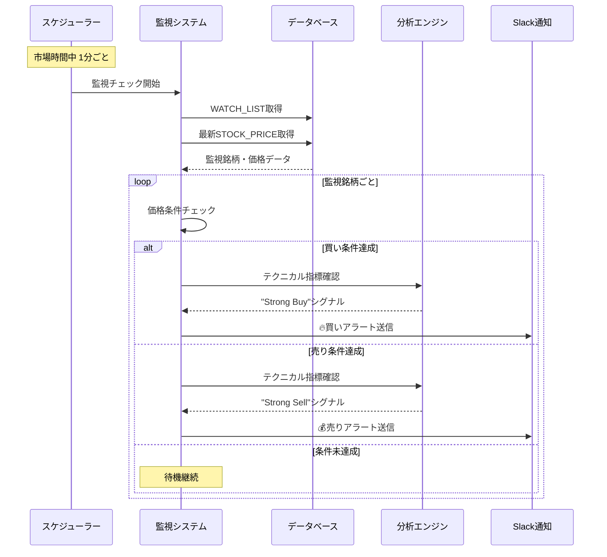
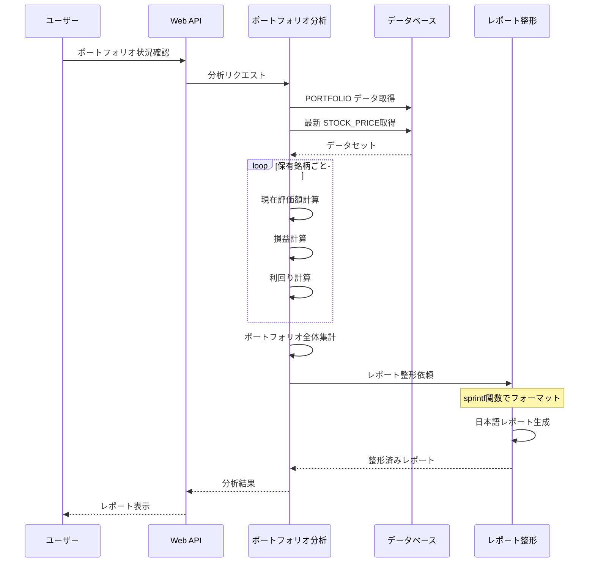
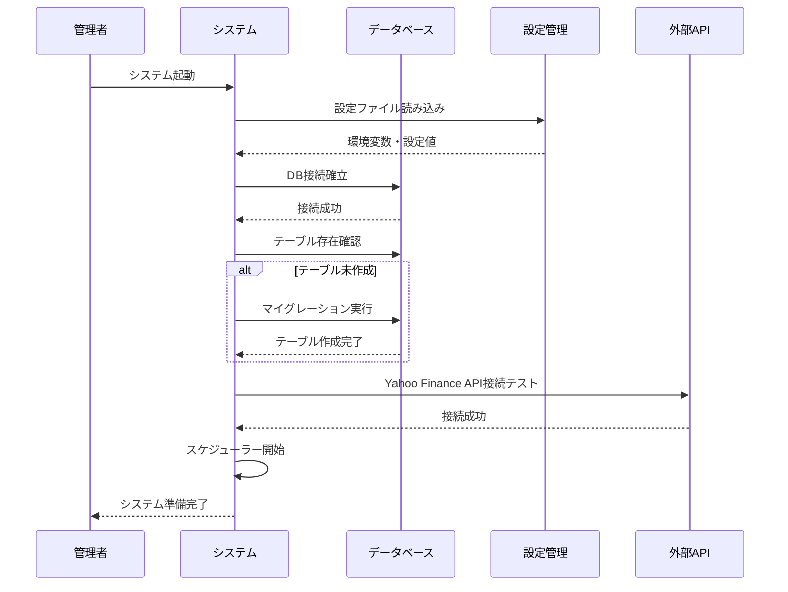
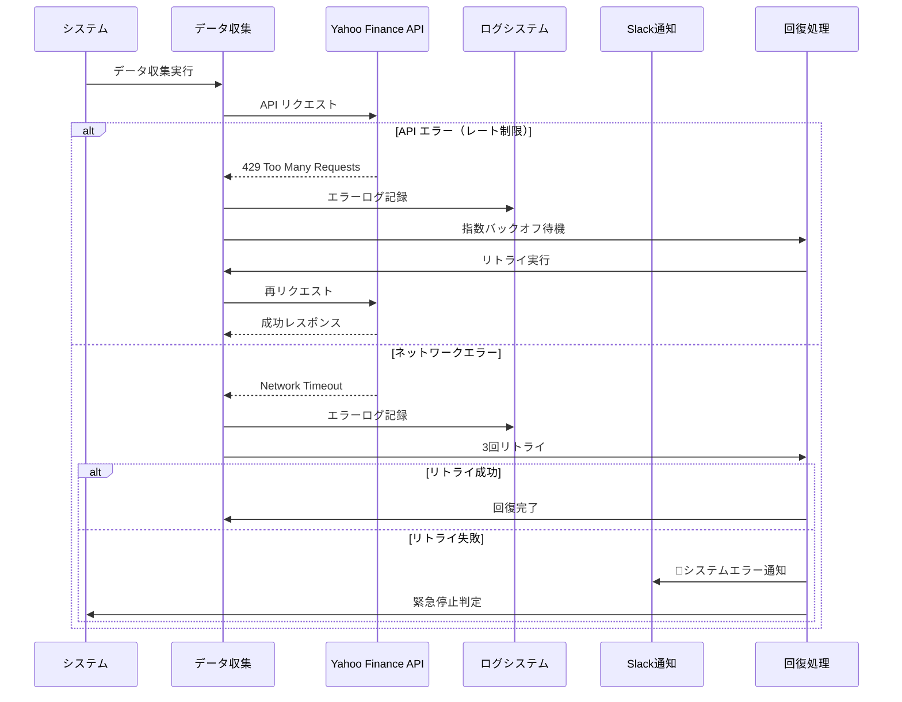

# システム動作フロー - シーケンス図

## 概要

株式自動化システムの主要な動作フローをシーケンス図で可視化し、各コンポーネントの連携と処理の流れを明確化します。

## 🔄 メインフロー

### 1. 📊 日次データ収集・分析フロー



**このフローの目的**: 
- 定期的な株価データ収集の自動化
- テクニカル指標の自動計算
- 日次投資状況レポートの自動配信

### 2. 🚨 リアルタイム監視・アラートフロー



**このフローの目的**:
- 投資機会の自動検出
- 売買タイミングの即座通知
- 人間の判断をサポート

### 3. 📈 ポートフォリオ分析フロー



**このフローの目的**:
- 投資パフォーマンスの可視化
- 損益状況の正確な把握
- 投資判断材料の提供

### 4. ⚙️ システム初期化・設定フロー



### 5. 🚨 エラーハンドリング・回復フロー



## 📋 シーケンス図から見える実装のポイント

### 🎯 現在の実装状況と必要な作業

#### ✅ 実装済み
- データベース設計・接続
- Yahoo Finance API 連携
- テクニカル指標計算ロジック
- 基本的なエラーハンドリング

#### 🚧 要実装（sprintf関数等）

**1. Reporter の sprintf関数**
```go
// 現在: プレースホルダー状態
func sprintf(format string, args ...interface{}) string {
    // TODO: 実装が必要
}

// 必要な実装: 日本語レポート整形
func sprintf(format string, args ...interface{}) string {
    switch format {
    case "現在価値: ¥%,.0f\n":
        return fmt.Sprintf("現在価値: ¥%,.0f\n", args[0])
    // ... 他のフォーマット対応
    }
}
```

**2. DataCollector の完全実装**
```go
// 必要な機能
- Yahoo Finance API からの安定した株価取得
- エラー時のリトライ機能
- レート制限対応
- データベース保存処理
```

**3. スケジューラーとの統合**
```go
// 必要な機能  
- 定時実行の設定
- 各コンポーネントとの連携
- エラー時の通知
```

### 🔄 データフローの重要性

これらのシーケンス図により、各実装が**なぜ必要か**が明確になります：

1. **sprintf関数**: ポートフォリオ分析結果を人間が読みやすい形式でSlack通知するため
2. **DataCollector**: 投資判断の基盤となる正確な株価データを自動収集するため  
3. **スケジューラー**: 人間の操作なしに24時間自動で投資監視を行うため

これで実装内容の目的と全体の中での位置づけが明確になりました！