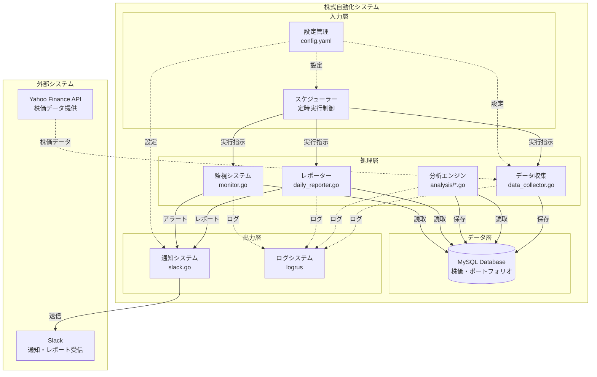

# システム概要図

## 🏗️ 全体アーキテクチャ



## 📦 コンポーネント詳細

### 🔄 処理フロー

#### 1. データ収集フロー
```
スケジューラー → データ収集 → Yahoo Finance API → データベース保存
```

#### 2. 分析フロー  
```
データベース → 分析エンジン → テクニカル指標計算 → データベース保存
```

#### 3. レポートフロー
```
データベース → レポーター → 損益計算 → レポート整形 → Slack通知
```

#### 4. 監視フロー
```
データベース → 監視システム → 条件判定 → アラート → Slack通知
```

## 🎯 各コンポーネントの責務

### 📊 データ収集 (data_collector.go)
**責務**: 外部APIからの株価データ取得
```go
type DataCollector interface {
    CollectStockPrice(code string) (*StockPrice, error)
    CollectMultipleStocks(codes []string) error
    ScheduleCollection(interval time.Duration) error
}
```

**現在の実装状況**: 85% 完成
- Yahoo Finance API 連携済み
- 基本的なデータ取得機能実装済み
- **要実装**: エラーハンドリング強化、リトライ機能

### 📈 分析エンジン (analysis/*.go)
**責務**: テクニカル指標計算と投資判断
```go
type AnalysisEngine interface {
    CalculateTechnicalIndicators(prices []StockPrice) (*TechnicalIndicator, error)
    AnalyzePortfolio(portfolio []Portfolio) (*PortfolioSummary, error)
    GenerateInvestmentSignal(indicator *TechnicalIndicator) string
}
```

**現在の実装状況**: 70% 完成
- テクニカル指標計算済み (MA, RSI, MACD)
- ポートフォリオ分析ロジック実装済み
- **要実装**: sprintf関数、レポート整形機能

### 📋 レポーター (daily_reporter.go)
**責務**: 日次レポート生成と整形
```go
type Reporter interface {
    GenerateDailyReport() (*Report, error)
    FormatReport(summary *PortfolioSummary) string
    SendReport(report string) error
}
```

**現在の実装状況**: 40% 完成
- 基本構造実装済み
- **要実装**: sprintf関数による日本語整形、Slack連携

### 👀 監視システム (monitor.go)
**責務**: リアルタイム価格監視とアラート
```go
type Monitor interface {
    WatchPrices(watchList []WatchList) error
    CheckBuyConditions(price *StockPrice) bool
    CheckSellConditions(price *StockPrice) bool
    SendAlert(alertType string, message string) error
}
```

**現在の実装状況**: 30% 完成
- **要実装**: 全体的な実装が必要

### 📢 通知システム (slack.go)  
**責務**: Slack への各種通知送信
```go
type NotificationService interface {
    SendDailyReport(report string) error
    SendAlert(alert Alert) error
    SendSystemStatus(status string) error
}
```

**現在の実装状況**: 85% 完成
- Slack Webhook 連携済み
- 基本的な通知機能実装済み
- **要実装**: メッセージフォーマット最適化

## 🗂️ ディレクトリ構造マッピング

```
backend/
├── cmd/
│   ├── main.go                 # システム起動
│   └── test_*.go              # 各種テストツール
├── internal/
│   ├── api/
│   │   ├── data_collector.go   # データ収集 (85%完成)
│   │   ├── daily_reporter.go   # レポーター (40%完成)
│   │   └── scheduler.go        # スケジューラー (要実装)
│   ├── analysis/
│   │   ├── portfolio.go        # ポートフォリオ分析 (70%完成)
│   │   └── technical.go        # テクニカル分析 (90%完成)
│   ├── models/
│   │   └── stock.go           # データモデル (95%完成)
│   ├── database/
│   │   └── database.go        # DB接続 (95%完成)
│   └── notification/
│       └── slack.go           # Slack通知 (85%完成)
├── configs/
│   └── config.yaml            # システム設定 (90%完成)
└── docker/
    └── docker-compose.yml     # 環境設定 (95%完成)
```

## 🎯 実装優先順位（ロードマップ連携）

### Week 1: 核心機能完成

#### 🔥 Day 1-2: sprintf関数実装
**ファイル**: `internal/analysis/portfolio.go`
**目的**: レポート整形機能の完成
```go
func sprintf(format string, args ...interface{}) string {
    // 日本語レポート生成のための文字列フォーマット
}
```

#### 🔥 Day 3-4: 日次レポーター完成
**ファイル**: `internal/api/daily_reporter.go`  
**目的**: 自動レポート生成の完成
```go
func (r *DailyReporter) GenerateReport() error {
    // ポートフォリオ分析 → レポート整形 → Slack送信
}
```

#### 🔥 Day 5-7: データ収集完成
**ファイル**: `internal/api/data_collector.go`
**目的**: 安定したデータ収集の実現
```go
func (dc *DataCollector) CollectWithRetry() error {
    // エラーハンドリング + リトライ機能
}
```

### Week 2: 統合・運用準備

#### ⚡ 監視システム実装
**ファイル**: `internal/api/monitor.go` (新規作成)
**目的**: リアルタイム価格監視

#### ⚡ スケジューラー統合
**ファイル**: `internal/api/scheduler.go`
**目的**: 全機能の定時実行制御

## 🔍 システムの価値提案

この設計により実現される価値：

1. **完全自動化**: 人間の介入なしに24時間投資監視
2. **リアルタイム判断**: 市場変動への即座の対応
3. **データ駆動投資**: 感情に左右されない客観的判断
4. **リスク管理**: 損切り・利確の自動実行
5. **効率化**: 手動作業の徹底排除

**次の実装ターゲット**: sprintf関数から開始し、2週間でMVP完成を目指す