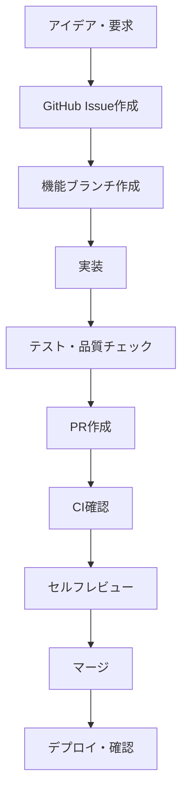

# 開発ワークフロー（1人プロジェクト版）

## 基本フロー



## 1. タスク管理

### Issue作成ルール
```markdown
# 機能要求
- タイトル: [FEATURE] 機能概要
- 何を・なぜ・どうやって を簡潔に記載
- 受け入れ基準をチェックボックスで列挙

# バグ報告  
- タイトル: [BUG] 問題概要
- 再現手順・期待値・実際の結果を記載
- 環境情報を含める

# タスク
- タイトル: [TASK] 作業内容
- 完了条件を明確に定義
- 工数見積を記載
```

### ラベル体系（簡略版）
- `enhancement` - 新機能・改善
- `bug` - バグ・不具合  
- `task` - 開発・運用作業
- `priority/high` - 高優先度
- `priority/low` - 低優先度

## 2. 開発フロー

### ブランチ戦略
```bash
# メインブランチ
main          # 本番用（常に動作）

# 作業ブランチ
feature/123-description  # 機能開発
fix/456-bug-name        # バグ修正
```

### 実装手順
```bash
# 1. 最新取得・ブランチ作成
git checkout main
git pull origin main  
git checkout -b feature/123-new-feature

# 2. 実装
# - 小さなコミット単位
# - コミットメッセージ規約準拠

# 3. 品質チェック
make test
make lint
make security

# 4. PR作成
git push origin feature/123-new-feature
# GitHub でPR作成
```

## 3. コーディング規約（要点）

### Go規約
```go
// パッケージ・ファイル構成
app/
├── models/      # データモデル
├── services/    # ビジネスロジック  
├── api/         # HTTPハンドラー
└── repository/  # データアクセス

// 命名規則
type StockPrice struct {}     // PascalCase
func GetStock() {}            // PascalCase
var stockCode string          // camelCase

// エラーハンドリング
if err != nil {
    return fmt.Errorf("failed to get stock: %w", err)
}

// ログ
logrus.WithFields(logrus.Fields{
    "code": stockCode,
    "action": "fetch",
}).Info("stock price updated")
```

### API規約
```go
// RESTful設計
GET    /api/v1/stocks/{code}        # 取得
POST   /api/v1/stocks              # 作成
PUT    /api/v1/stocks/{code}       # 更新
DELETE /api/v1/stocks/{code}       # 削除

// レスポンス形式
{
    "data": {...},           // 成功時
    "error": "message"       // エラー時
}
```

## 4. テスト戦略（簡略版）

### テスト構成
```bash
# 単体テスト（重要機能のみ）
make test

# 統合テスト（主要フロー）
make test-integration

# 手動テスト（受け入れ基準確認）
```

### テストファイル例
```go
func TestStockService_GetStock(t *testing.T) {
    // 正常ケース・エラーケースの基本パターンのみ
    tests := []struct {
        name string
        code string
        want *Stock
        err  error
    }{
        {"正常", "1234", expectedStock, nil},
        {"未発見", "9999", nil, ErrNotFound},
    }
    
    for _, tt := range tests {
        t.Run(tt.name, func(t *testing.T) {
            // テスト実行
        })
    }
}
```

## 5. PR・レビュープロセス

### PR作成時チェック
```markdown
# セルフレビューチェックリスト
- [ ] 動作確認完了
- [ ] テスト通過
- [ ] lint エラーなし  
- [ ] コミットメッセージ適切
- [ ] 不要コード削除済み

# PR説明（簡潔に）
## 概要
何を実装したか

## 変更内容  
- 主な変更点

## テスト
- 動作確認内容
```

### AIレビュー活用
```markdown
# ChatGPT/Claude への確認依頼例

「以下のGoコードをレビューしてください：
- バグはないか
- パフォーマンス問題はないか  
- セキュリティ問題はないか
- より良い書き方があるか

[コード貼り付け]」
```

## 6. デプロイ・運用

### 本番デプロイ前確認
```bash
# ローカル環境での最終確認
make dev
# 主要機能の動作確認

# 本番デプロイ
make deploy
# またはCI/CDで自動デプロイ

# 動作確認
curl /api/v1/health
```

### 緊急対応
```bash
# 問題発生時
1. [BUG] Issue作成
2. hotfix/xxx ブランチで修正
3. 最小限テストで即デプロイ
4. 事後に詳細テスト追加
```

## 7. AI活用による効率化

### コード生成・レビュー
- 定型的なCRUD実装はAIに生成依頼
- セキュリティ・パフォーマンス観点でAIレビュー
- テストケース作成をAI支援

### ドキュメント作成
- API仕様書の雛型生成
- 複雑なロジックの説明文生成
- README・設定手順の更新支援

### 設計相談  
- アーキテクチャ選択の相談
- ライブラリ選定のアドバイス
- ベストプラクティスの確認

これで1人プロジェクトに適した効率的な開発プロセスが構築できます。